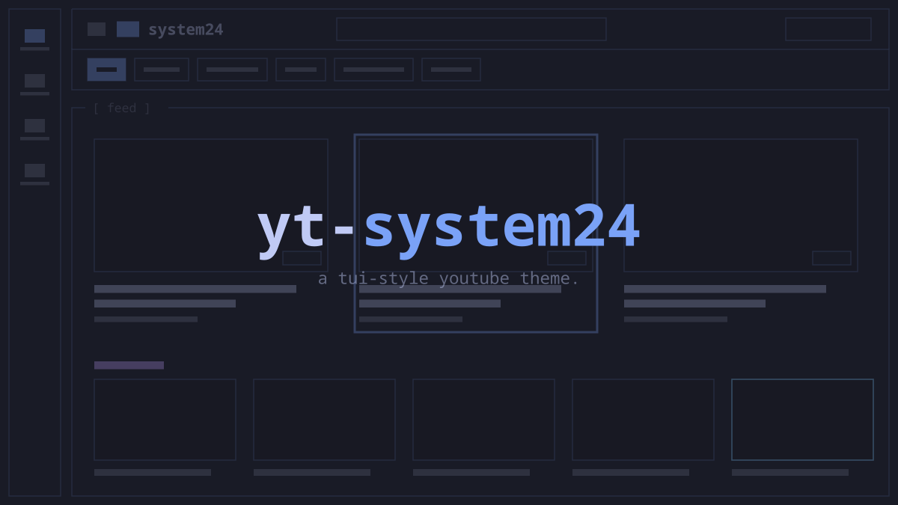
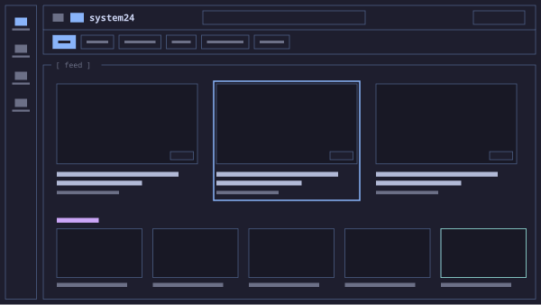
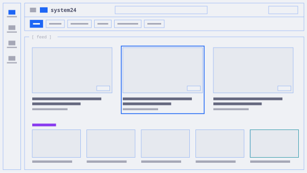
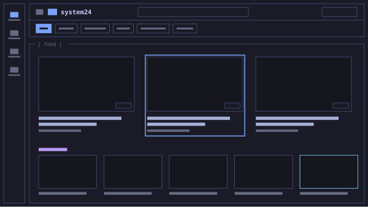
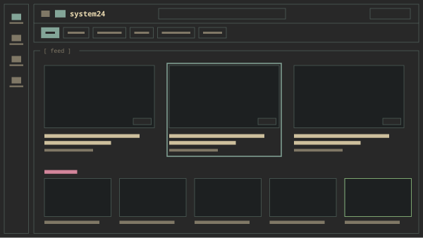
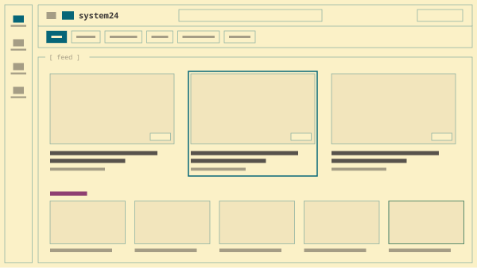
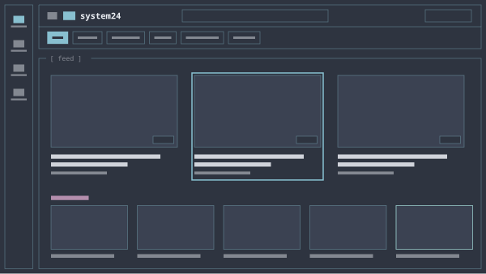
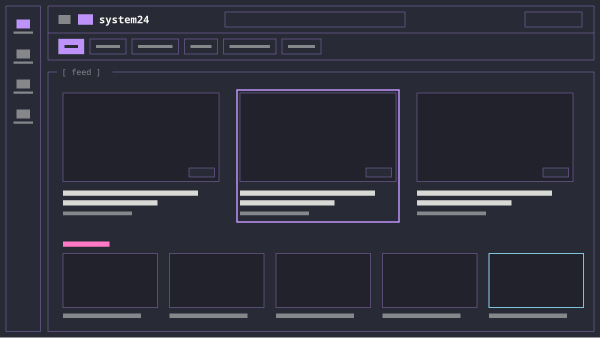
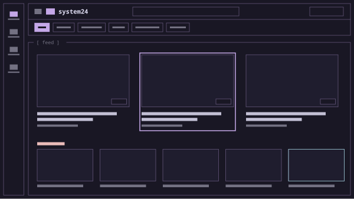

# yt-system24

a tui-style youtube theme, themeable from your wallpaper. inspired by
[refact0r's system24](https://github.com/refact0r/system24) for discord.

covers `youtube.com`

## install

1. install [stylus](https://addons.mozilla.org/firefox/addon/styl-us/) —
   firefox or chrome
2. click a flavour below. stylus offers to install it
3. done

the two files in `userscripts/` are optional and go in tampermonkey or
violentmonkey. the stylesheet works without them, but hover previews behave
better with `yt-panel-scroll-sync` installed.

## flavours

click a name to install, or an image to view it full size.

| [catppuccin mocha](dist/flavours/catppuccin-mocha.user.css) | [catppuccin latte](dist/flavours/catppuccin-latte.user.css) | [tokyo night](dist/flavours/tokyo-night.user.css) |
|:--|:--|:--|
| [](assets/flavours/catppuccin-mocha.png) | [](assets/flavours/catppuccin-latte.png) | [](assets/flavours/tokyo-night.png) |
| [**gruvbox dark**](dist/flavours/gruvbox-dark.user.css) | [**gruvbox light**](dist/flavours/gruvbox-light.user.css) | [**nord**](dist/flavours/nord.user.css) |
| [](assets/flavours/gruvbox-dark.png) | [](assets/flavours/gruvbox-light.png) | [](assets/flavours/nord.png) |
| [**dracula**](dist/flavours/dracula.user.css) | [**rosé pine**](dist/flavours/rose-pine.user.css) | |
| [](assets/flavours/dracula.png) | [](assets/flavours/rose-pine.png) | |

previews are drawn from each palette rather than screenshotted, so they always
match what ships.

## your own colours

edit the `:root` block at the top of any flavour, in stylus:

```css
--yt-bg:    #1a1b26;   /* page background         */
--yt-panel: #16161e;   /* panels, raised surfaces */
--yt-hot:   #7aa2f7;   /* accent, hover rings     */
--yt-text:  #c0caf5;
```

border weights, ring thickness, panel padding, motion and the `[ panel ]`
labels are all `--s24-*` tokens in the same block.

## with pywal

`templates/youtube.user.css` is a pywal template. it reads six keys out of
`~/.cache/wal/colors.json` and doesn't care what wrote them — pywal's own
extraction, a preset, or an external scheme generator:

```bash
cp templates/youtube.user.css ~/.config/wal/templates/
wal -i ~/Pictures/wallpaper.jpg
wl-copy < ~/.cache/wal/youtube.user.css    # macos: pbcopy · x11: xclip -sel clip
```

then paste into a new stylus style.

**don't install the pywal build from a url.** it carries an `@updateURL`, so
stylus would auto-update over your palette. let pywal be what updates that
copy.

there's no light/dark switch and nothing reads your system theme — light mode
just means light colours. pywal is linux/macos in practice; on windows, use a
flavour.

## docs

[developing.md](docs/DEVELOPING.md) — editing the template, the build scripts,
and the debugging traps this theme has already fallen into.

## licence

MIT. with thanks to [refact0r/system24](https://github.com/refact0r/system24).
